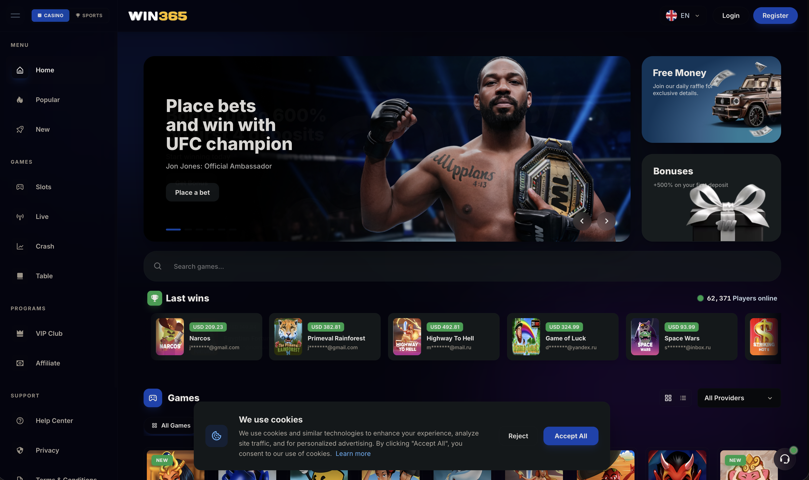

<div align="center">


# OSS Casino 2026

### Formerly Goldsvet — Web Casino Platform & Server Configuration Guide

[](https://laravel.com)
[](https://php.net)
[](https://nodejs.org)
[](https://mysql.com)
[](https://redis.io)
[](https://pm2.keymetrics.io)

**Official Telegram Community:** [t.me/osscasino](https://t.me/osscasino)



**OSS Casino 3.0 (2026 release)** adds **Laravel 12** and **PHP 8.3+** support, an **easy one-file installer**, a merged single database, and demo play accounts — now shipping with **1,200+ games**.

</div>

---

> [!WARNING]
> **Beware of impersonators.** Any fork, mirror, or Telegram account claiming to represent us — other than [@osscasino](https://t.me/osscasino) — is **not official**. The old group `@goldsvetcasino1` is no longer affiliated with this project. Always verify you are dealing with the official account before sending any payment.

## 📋 Table of Contents

- [About This Repository](#-about-this-repository)
- [Highlights](#-highlights)
- [Tech Stack](#-tech-stack)
- [Server Requirements](#-server-requirements)
- [Installation](#-installation)
  - [Quick Installer](#quick-installer-recommended)
  - [Manual Installation](#manual-installation)
- [SSL Configuration](#-ssl-configuration)
- [WebSocket Configuration](#-websocket-configuration)
- [Process Management (PM2)](#-process-management-pm2)
- [Firewall Configuration](#%EF%B8%8F-firewall-configuration)
- [Support & Contact](#-support--contact)
- [Disclaimer](#%EF%B8%8F-disclaimer)

## 📖 About This Repository

This repository contains a **public preview** of the OSS Casino platform (formerly Goldsvet) — a full-featured web casino solution built on Laravel with a Node.js real-time game server.

The complete source distribution includes **1,200+ games (50+ GB)** — among others the latest **Pragmatic Play** titles and **PG Soft** games (fixed and mobile-responsive) — and is distributed directly through our Telegram community, together with optional installation service on your VPS or dedicated server.

| Path | Description |
| --- | --- |
| `index.php` | Laravel application entry point |
| `back/` | Admin panel (based on AdminLTE) |
| `frontend/` | Frontend themes (`Default`, `Tropicoblack`, legacy) |
| `storage/` | Tournaments and application storage |
| `socket_config.json`, `socket_config2.json`, `arcade_config.json` | WebSocket / arcade server configuration |
| `.htaccess` | Apache rewrite rules |

## ✨ Highlights

- **1,200+ games** — Pragmatic Play, PG Soft (fixed & mobile responsive), EGT, KA, and more
- **Laravel 12** backend with a merged **single database**
- **Node.js WebSocket game server** (PM2-managed) for real-time game sessions
- **Multiple frontend themes** out of the box
- **Demo user accounts** with demo play mode
- **Quick installer** (`setup.php`) for guided setup
- **Easy-Installer & PHP 8.3+ support** in the 3.0 (2026) release

## 🧱 Tech Stack

| Component | Technology |
| --- | --- |
| Backend framework | Laravel 12 (PHP 8.3+) |
| Real-time game server | Node.js 22 + PM2 (`UnifiedServer.js`) |
| Database | MySQL |
| Cache / queues | Redis |
| Web server | Apache |
| Recommended OS | AlmaLinux 8 / CentOS 7 |

## 📦 Server Requirements

| Requirement | Notes |
| --- | --- |
| Operating system | AlmaLinux 8 or CentOS 7 (recommended) |
| Web server | Apache with `mod_rewrite`, SSL enforced |
| PHP | 8.3 or newer |
| PHP extensions | `fileinfo`, `imagick`, `redis` |
| Database | MySQL 8.0+ (or compatible MariaDB) |
| Node.js | 22.x |
| Process manager | PM2 (`npm install -g pm2`) |
| Cache | Redis |

## 🚀 Installation

### Quick Installer (recommended)

1. Upload or clone all files from this repository into your `public_html` folder.
2. Navigate to `https://yourdomain.com/setup.php` and follow the guided installation.

### Manual Installation

1. **Provision the server** with the components listed under [Server Requirements](#-server-requirements).

2. **Enable the required PHP extensions:** `fileinfo`, `imagick`, `redis`.

3. **Configure your domain** and enforce SSL for it.

4. **Deploy the code** — clone or extract this repository into the `public_html` folder of your domain.

5. **Create the database:**
   - Create a new MySQL database and user, and grant the user full access to it.
   - Import the SQL dump `db.sql` from the distribution package.

6. **Install Composer dependencies** — run the following from the terminal inside `public_html`:

   ```bash
   composer install
   ```

7. **Configure the application:**
   - Set your domain, database credentials, and mail settings (create a mailbox for the system and set its password) in `.env` and `config/app.php` (URL, around line 65).

8. **Secure demo accounts (important):** the distribution ships with demo user accounts. Generate new password hashes for existing users and update them — you can create bcrypt hashes at [bcrypt-generator.com](https://bcrypt-generator.com/) and apply them via phpMyAdmin.

## 🔒 SSL Configuration

The WebSocket server requires a valid SSL certificate (Let's Encrypt or commercial — self-signed certificates will not work reliably):

1. Delete any existing self-signed certificates.
2. Issue or install a Let's Encrypt certificate for your domain.
3. Save the certificate files as plain text:
   - Certificate (CRT) → `crt.crt`
   - Private key (KEY) → `key.key`
4. Copy both files into the `PTWebSocket/ssl/` folder, replacing the existing ones.

## 📡 WebSocket Configuration

WebSocket and arcade server settings live in the JSON files in the repository root:

| File | Purpose |
| --- | --- |
| `socket_config.json` | Main slot game WebSocket server |
| `socket_config2.json` | Secondary WebSocket server |
| `arcade_config.json` | Arcade game server (also sets the timezone) |

Example (`socket_config.json`):

```json
{
  "port": "22188/arcade",
  "host": "localhost",
  "prefix": "https://",
  "host_ws": "localhost",
  "prefix_ws": "wss://",
  "ssl": true,
  "timezone": "Europe/Berlin"
}
```

Adjust `port`, `host`, and `host_ws` to match your domain and chosen WebSocket ports.

## 🔄 Process Management (PM2)

General PM2 commands (see the [PM2 documentation](https://pm2.keymetrics.io/docs/usage/quick-start/) for the full reference):

```bash
pm2 stop all
pm2 delete all
pm2 flush
pm2 logs
pm2 save
```

Start the game server from inside the `PTWebSocket` folder:

```bash
pm2 start UnifiedServer.js --watch
```

## 🛡️ Firewall Configuration

Open the ports used by your WebSocket servers, then reload the firewall:

```bash
firewall-cmd --zone=public --add-port=xxxx/tcp --permanent
firewall-cmd --zone=public --add-port=yyyy/tcp --permanent
firewall-cmd --zone=public --add-port=zzzz/tcp --permanent
firewall-cmd --reload
```

## 📞 Support & Contact

Interested in the full version, or need installation on your VPS / dedicated server?

| Channel | Link |
| --- | --- |
| Telegram Group (official) | [t.me/osscasino](https://t.me/osscasino) |
| Personal Telegram (sales & installation) | [t.me/chessmate77](https://t.me/chessmate77) |

## ⚖️ Disclaimer

This software is provided for informational and educational purposes as a platform preview. Operating an online gambling service is heavily regulated and may be restricted or prohibited in your jurisdiction. Anyone deploying this software is solely responsible for obtaining the required licenses and complying with all applicable local, national, and international laws. The authors accept no liability for misuse of this software.

---

<div align="center">

<sub>© 2026 OSS Casino — formerly Goldsvet. All rights reserved.</sub>

</div>
