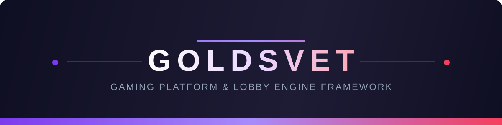

<div align="center">



**A modular, API-first framework for building online gaming platforms.**

[](#roadmap)
[](https://www.php.net)
[](https://laravel.com)
[](https://vuejs.org)
[](https://www.mysql.com)
[](https://redis.io)
[](#license)

</div>

---

## Overview

Goldsvet provides the backbone every gaming platform needs - lobby, accounts, wallet, and administration - as clean, swappable modules so operators and development teams can focus on the games, not the plumbing.

- **API-first** - every capability is exposed over a versioned REST API
- **Modular** - enable only the modules you need; no monolith lock-in
- **Provider-agnostic** - the wallet and lobby layers integrate with any game source
- **Operations-ready** - queues, caching, and reporting wired in from day one

## Feature Modules

| Module | What it does |
|--------|--------------|
| **Lobby Engine** | Configurable game lobby with categories, search, and featured placements |
| **Player Accounts** | Registration, authentication, sessions, KYC-ready profile structure |
| **Wallet & Transactions** | Provider-agnostic balance layer with full transaction ledger |
| **Admin Panel** | Content, player, and configuration management with role-based access |
| **Reporting** | Operational dashboards and exportable reports |
| **REST API** | Consistent, versioned endpoints across all modules |

## Architecture

```
┌─────────────────────────────────────────────────────────┐
│                       Clients                           │
│            Web (Vue 3)  ·  Mobile  ·  Partners          │
└──────────────────────────┬──────────────────────────────┘
                           │ REST API (versioned)
┌──────────────────────────▼──────────────────────────────┐
│                    API Gateway (Laravel)                │
│         Auth · Rate limiting · Request validation       │
├──────────────┬──────────────┬───────────────────────────┤
│    Lobby     │    Wallet    │      Admin & Reporting    │
│    Module    │    Module    │           Module          │
├──────────────┴──────────────┴───────────────────────────┤
│          MySQL 8 (state)      Redis (cache + queue)     │
└─────────────────────────────────────────────────────────┘
```

## Quick Start

> Documentation is being written as modules stabilize. The structure below reflects the target developer experience.

```bash
git clone https://github.com/ZeusbyteInc/goldsvet.git
cd goldsvet
cp .env.example .env

composer install
npm install && npm run build

php artisan key:generate
php artisan migrate --seed
php artisan serve
```

## Roadmap

- [x] Project architecture and module boundaries
- [ ] Wallet core and transaction ledger
- [ ] Lobby engine with category management
- [ ] Admin panel MVP
- [ ] Reporting dashboards
- [ ] Public API documentation
- [ ] Reference deployment guide

## License

Copyright © 2026 Zeusbyte Inc. All rights reserved.

This repository contains **original code developed independently**; it is not derived from any third-party product. Intended for legitimate, licensed use cases only.

---

<div align="center">

**Zeusbyte Inc.** — [github.com/ZeusbyteInc](https://github.com/ZeusbyteInc)

</div>
pe
