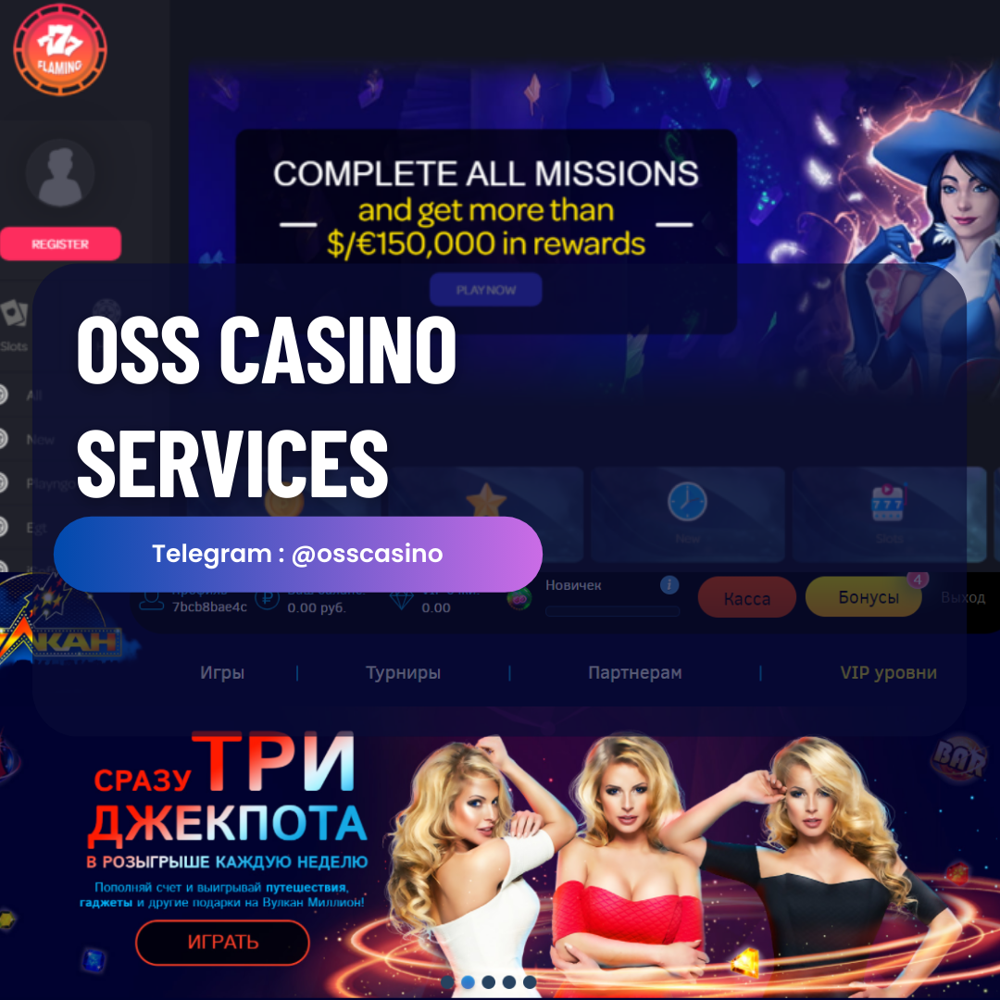

# OSS Casino 2026



Web casino platform, formerly known as **Goldsvet**. This repository is the official distribution point of the project. Release 3.0 (2026) runs on Laravel 12 with PHP 8.4, a quick installer, a merged single database, and demo play accounts — shipping with more than 1,300 games.

Official Telegram channel: **[t.me/goldsvet1](https://t.me/goldsvet1)** (10,000+ subscribers) — official group: **[@osscasino](https://t.me/osscasino)**

## Old repository and account

The project was previously distributed under the `github.com/zeusbyte` account at `github.com/zeusbyte/goldsvet`. Following the departure of former team members, that account and its repositories are **no longer controlled or maintained by the current development team** and are not affiliated with this project. Treat any repository, release, or fork originating from the old account as unofficial — this repository is the only official one.

Only the GitHub account has changed. The official Telegram channel and group, **[t.me/goldsvet1](https://t.me/goldsvet1)** and **[@osscasino](https://t.me/osscasino)**, remain exactly as before and are unaffected by the move — anything else claiming to represent us on Telegram, including the old ~~@goldsvetcasino1~~ group, is not official.

## About this repository

This repository contains a public preview of the platform: the Laravel entry point, the admin panel, the frontend themes, and the server configuration files.

The complete source distribution — more than 1,300 games totaling over 60 GB, including the latest Pragmatic Play titles and PG Soft games (fixed and mobile-responsive) — is distributed directly through our Telegram community, together with optional installation service on your VPS or dedicated server.

Repository layout:

- `index.php` — Laravel application entry point
- `back/` — admin panel (based on AdminLTE)
- `frontend/` — frontend themes (`Default`, `Tropicoblack`, legacy)
- `storage/` — tournaments and application storage
- `socket_config.json`, `socket_config2.json`, `arcade_config.json` — WebSocket and arcade server configuration
- `.htaccess` — Apache rewrite rules

## Tech stack

- **Backend:** Laravel 12 on PHP 8.4 — Sanctum authentication, Stripe payments, Google 2FA, GeoIP, Spatie DB dumper
- **Frontend:** Inertia.js with Vue 3, Tailwind CSS, Alpine.js, Chart.js, built with Vite
- **Real-time game server:** Node.js (`UnifiedServer.js`) with ws and Socket.IO, direct MySQL and Redis access, Winston logging, managed with PM2
- **Data:** MySQL 8, Redis

## Requirements

- AlmaLinux 8 or CentOS 7 (recommended)
- Apache with `mod_rewrite`, SSL enforced on the domain
- PHP 8.4 or newer, with the `fileinfo`, `imagick`, and `redis` extensions
- MySQL 8.0 or newer
- Redis
- Node.js 22 and PM2 (`npm install -g pm2`)
- Composer

## Installation

### Quick installer

Upload or clone all files from this repository into your `public_html` folder, then open `https://yourdomain.com/setup.php` and follow the guided installation.

### Manual installation

1. Provision the server with the components listed under [Requirements](#requirements).

2. Point your domain to the server and enforce SSL.

3. Clone or extract this repository into the domain's `public_html` folder.

4. Create a MySQL database and user, grant the user full access, and import the SQL dump `db.sql` from the distribution package.

5. Install Composer dependencies from the terminal inside `public_html`:

   ```bash
   composer install
   ```

6. Set your domain, database credentials, and mail settings (create a mailbox for the system and set its password) in `.env` and `config/app.php` (URL, around line 65).

7. Generate new password hashes for the bundled demo user accounts — you can create bcrypt hashes at [bcrypt-generator.com](https://bcrypt-generator.com/) and apply them via phpMyAdmin. Do not go live with the default passwords.

## SSL configuration

The WebSocket server requires a valid SSL certificate. Self-signed certificates will not work reliably.

1. Delete any existing self-signed certificates.
2. Issue a Let's Encrypt certificate (or install a commercial one) for your domain.
3. Save the certificate files as plain text: certificate (CRT) as `crt.crt`, private key (KEY) as `key.key`.
4. Copy both files into the `PTWebSocket/ssl/` folder, replacing the existing ones.

## WebSocket configuration

WebSocket and arcade server settings live in the JSON files in the repository root: `socket_config.json` (main slot server), `socket_config2.json` (secondary server), and `arcade_config.json` (arcade games, also sets the timezone). Adjust `port`, `host`, and `host_ws` to match your domain and chosen WebSocket ports.

Example:

```json
{
  "port": "22188/arcade",
  "host": "localhost",
  "prefix": "https://",
  "host_ws": "localhost",
  "prefix_ws": "wss://",
  "ssl": true,
  "timezone": "Europe/Berlin"
}
```

## Process management

General PM2 commands — see the [PM2 documentation](https://pm2.keymetrics.io/docs/usage/quick-start/) for the full reference:

```bash
pm2 stop all
pm2 delete all
pm2 flush
pm2 logs
pm2 save
```

Start the game server from inside the `PTWebSocket` folder:

```bash
pm2 start UnifiedServer.js --watch
```

## Firewall

Open the ports used by your WebSocket servers, then reload the firewall:

```bash
firewall-cmd --zone=public --add-port=xxxx/tcp --permanent
firewall-cmd --zone=public --add-port=yyyy/tcp --permanent
firewall-cmd --zone=public --add-port=zzzz/tcp --permanent
firewall-cmd --reload
```

## Support

For the full version, or for installation on your VPS or dedicated server — the fastest way to get in touch is directly with the developer:

- **Developer contact: [t.me/chessmate77](https://t.me/chessmate77)** — fastest response, sales, and installation
- Telegram channel: [t.me/goldsvet1](https://t.me/goldsvet1) — 10,000+ subscribers
- Telegram group: [t.me/osscasino](https://t.me/osscasino)

## Disclaimer

This software is provided as a platform preview. Operating an online gambling service is heavily regulated and may be restricted or prohibited in your jurisdiction. Anyone deploying this software is solely responsible for obtaining the required licenses and complying with all applicable laws. The authors accept no liability for misuse.
