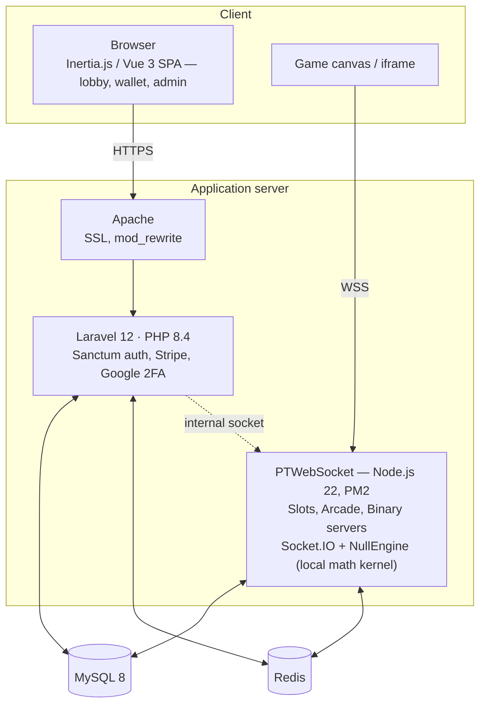

# OSS Casino 2026

[](https://github.com/ZeusbyteInc/goldsvet/actions/workflows/build.yml)
[](https://github.com/ZeusbyteInc/goldsvet/commits/main/)

[](https://php.net)
[](https://laravel.com)
[](https://vuejs.org)
[](https://mysql.com)
[](https://redis.io)
[](#disclaimer)

**Web casino platform — formerly Goldsvet.**

This is the official repository. Release 3.0 (2026) runs on Laravel 12 with PHP 8.4, ships a quick installer, a merged single database, demo play accounts, and more than 1,300 games.

<p align="center"></p>

| | |
| --- | --- |
| **Release** | 3.0 — 2026 |
| **Games** | 1,300+ titles · 60 GB+ |
| **Providers** | Pragmatic Play · PG Soft · EGT · KA · NetGame · and more |
| **Channel** | [t.me/goldsvet1](https://t.me/goldsvet1) |

---

## Official channels

| Channel | Link |
| --- | --- |
| Telegram channel | [t.me/goldsvet1](https://t.me/goldsvet1) |
| Telegram group | [t.me/osscasino](https://t.me/osscasino) |
| Developer — fastest response | [t.me/chessmate77](https://t.me/chessmate77) |

---

## Old repository and account

> [!WARNING]
> The project was previously distributed at `github.com/zeusbyte/goldsvet` under the `github.com/zeusbyte` account. That account and its repositories are **no longer controlled or maintained by the current development team** following the departure of former team members. Treat anything originating from the old account as unofficial — this repository is the only official source.

Only the GitHub account has changed. The official Telegram channel **[t.me/goldsvet1](https://t.me/goldsvet1)** and group **[@osscasino](https://t.me/osscasino)** remain exactly as before and are unaffected by the move — anything else claiming to represent us on Telegram, including the old ~~@goldsvetcasino1~~ group, is not official.

---

## Overview

This repository is a curated public preview of the platform: a selection of real source files from the current production codebase, published so you can verify the quality and architecture for yourself. The full distribution — more than 1,300 games totaling over 60 GB, listed title by title in the [complete game catalog](docs/GAMES.md) generated from the platform database — is available directly through our Telegram community, together with optional installation service on your VPS or dedicated server.

**What this preview includes**

- `composer.json` · `package.json` — the real dependency manifests of the platform
- `app/` — production domain models (`Shop`, `StatGame`, `Category`, `HappyHour`)
- `database/migrations/` — recent migrations from the live codebase
- `PTWebSocket/` — the Node.js game server entry point (`src/UnifiedServer.js`), PM2 configuration, and dependencies
- `docs/GAMES.md` — the full game catalog, 1,302 titles grouped by provider
- `socket_config.json` · `socket_config2.json` · `arcade_config.json` — WebSocket and arcade server configuration
- `index.php` · `.htaccess` · `storage/` — application entry point, Apache rules, and storage layout

---

## Tech stack

| Layer | Technology |
| --- | --- |
| Backend | Laravel 12 on PHP 8.4 — Sanctum, Stripe, Google 2FA, GeoIP |
| Frontend | Inertia.js with Vue 3, Tailwind CSS, Alpine.js, Chart.js — built with Vite |
| Game server | Node.js (`UnifiedServer.js`) with ws and Socket.IO, direct MySQL and Redis access, Winston logging — managed with PM2 |
| Data | MySQL 8, Redis |

## Architecture



The web application and the real-time game server are separate processes: Laravel serves the SPA and handles authentication, payments, and administration, while the Node.js server runs every live game session over an encrypted WebSocket. Both share the same MySQL database and Redis caches, and Laravel coordinates the game server through an authenticated internal socket.

---

## Requirements

- AlmaLinux 8 or CentOS 7 (recommended)
- Apache with `mod_rewrite`, SSL enforced on the domain
- PHP 8.4 or newer, with the `fileinfo`, `imagick`, and `redis` extensions
- MySQL 8.0 or newer
- Redis
- Node.js 22 and PM2 (`npm install -g pm2`)
- Composer

---

## Installation

**Quick installer** — upload or clone all files into your `public_html` folder, then open `https://yourdomain.com/setup.php` and follow the guided installation.

**Manual installation**

1. Provision the server with the components listed under [Requirements](#requirements).
2. Point your domain to the server and enforce SSL.
3. Clone or extract this repository into the domain's `public_html` folder.
4. Create a MySQL database and user, grant the user full access, and import the SQL dump `db.sql` from the distribution package.
5. Install Composer dependencies from the terminal inside `public_html`:

   ```bash
   composer install
   ```

6. Set your domain, database credentials, and mail settings (create a mailbox for the system and set its password) in `.env` and `config/app.php` (URL, around line 65).
7. Generate new password hashes for the bundled demo user accounts — create bcrypt hashes at [bcrypt-generator.com](https://bcrypt-generator.com/) and apply them via phpMyAdmin. Do not go live with the default passwords.

---

## SSL configuration

The WebSocket server requires a valid SSL certificate. Self-signed certificates will not work reliably.

1. Delete any existing self-signed certificates.
2. Issue a Let's Encrypt certificate (or install a commercial one) for your domain.
3. Save the certificate files as plain text: certificate (CRT) as `crt.crt`, private key (KEY) as `key.key`.
4. Copy both files into the `PTWebSocket/ssl/` folder, replacing the existing ones.

---

## WebSocket configuration

WebSocket and arcade server settings live in the JSON files in the repository root: `socket_config.json` (main slot server), `socket_config2.json` (secondary server), and `arcade_config.json` (arcade games, also sets the timezone). Adjust `port`, `host`, and `host_ws` to match your domain and chosen WebSocket ports.

```json
{
  "port": "22188/arcade",
  "host": "localhost",
  "prefix": "https://",
  "host_ws": "localhost",
  "prefix_ws": "wss://",
  "ssl": true,
  "timezone": "Europe/Berlin"
}
```

---

## Process management

General PM2 commands — see the [PM2 documentation](https://pm2.keymetrics.io/docs/usage/quick-start/) for the full reference:

```bash
pm2 stop all
pm2 delete all
pm2 flush
pm2 logs
pm2 save
```

Start the game server from inside the `PTWebSocket` folder:

```bash
pm2 start UnifiedServer.js --watch
```

---

## Firewall

Open the ports used by your WebSocket servers, then reload the firewall:

```bash
firewall-cmd --zone=public --add-port=xxxx/tcp --permanent
firewall-cmd --zone=public --add-port=yyyy/tcp --permanent
firewall-cmd --zone=public --add-port=zzzz/tcp --permanent
firewall-cmd --reload
```

---

## Support

The fastest way to get in touch is directly with the developer — for the full version, or for installation on your VPS or dedicated server:

- **Developer: [t.me/chessmate77](https://t.me/chessmate77)** — fastest response, sales, and installation
- Channel: [t.me/goldsvet1](https://t.me/goldsvet1)
- Group: [t.me/osscasino](https://t.me/osscasino)

---

## Disclaimer

This software is provided as a platform preview. Operating an online gambling service is heavily regulated and may be restricted or prohibited in your jurisdiction. Anyone deploying this software is solely responsible for obtaining the required licenses and complying with all applicable laws. The authors accept no liability for misuse.
